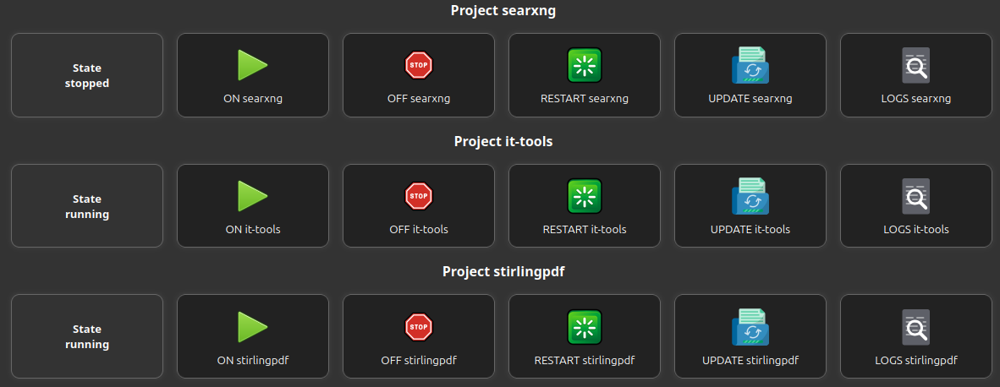
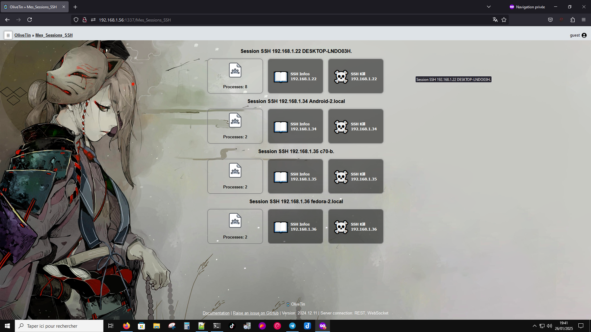
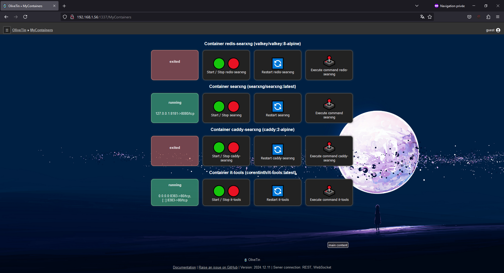
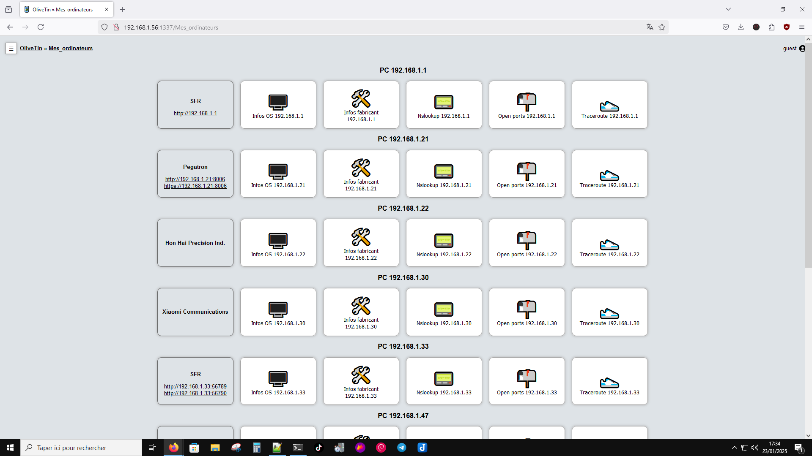
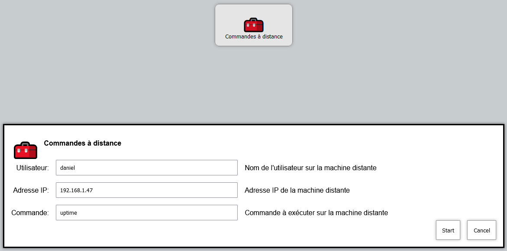
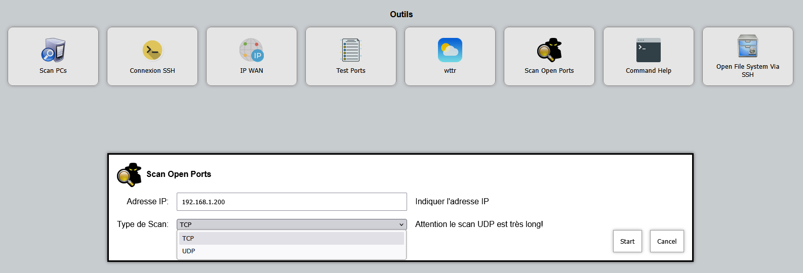
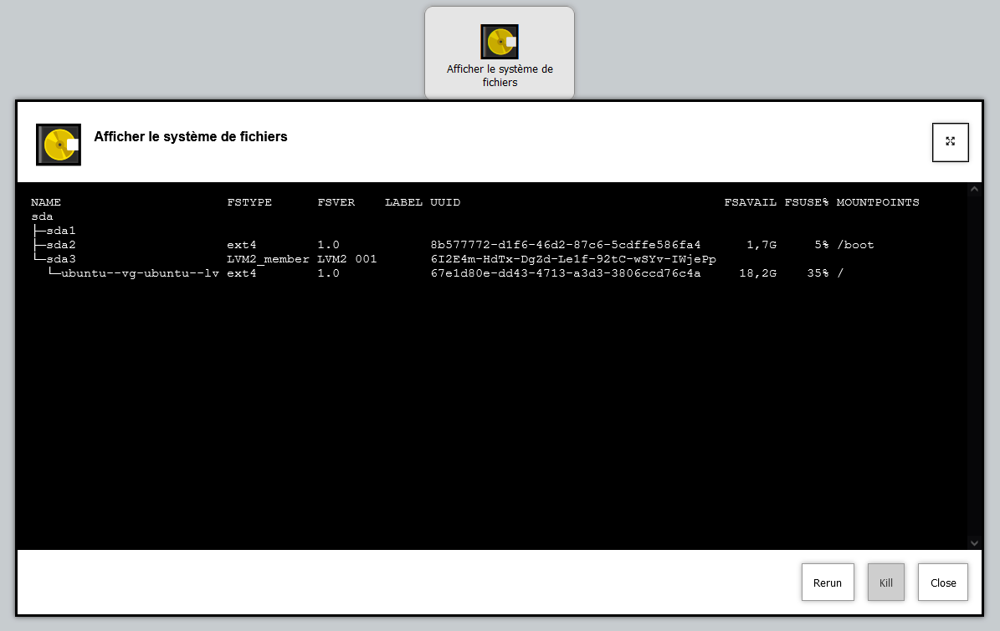
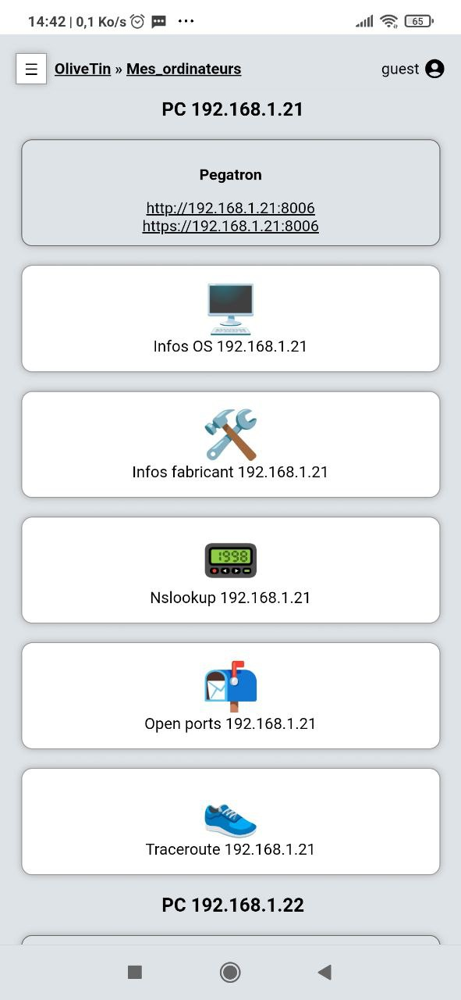

# My-OliveTin-examples
**Un dépôt regroupant des exemples de configurations, scripts et actions pour OliveTin.**

## Présentation d'OliveTin
**OliveTin** est un service web sécurisé et léger qui permet d’exécuter des scripts ou commandes shell via des boutons interactifs, des affichages et des fenêtres de saisie.
Il est open-source, écrit en **Go** et **JavaScript**, et consomme très peu de ressources.  
Grâce à son interface intuitive, n’importe qui peut exécuter des commandes sans connaissances techniques.
Par exemple, un simple clic suffit pour démarrer un serveur multimédia Docker.
Il simplifie aussi les commandes complexes en les rendant accessibles via une interface claire.  
OliveTin fonctionne sur **PC, smartphone et tablette**, s’adapte aux thèmes clair/sombre et s’installe facilement via paquets ou conteneurs Linux.
La configuration se fait via un fichier **config.yaml**, et il est compatible avec de nombreux outils, offrant des possibilités infinies !  

🌐 **Site web** : [olivetin.app](https://www.olivetin.app/)  
🐙 **GitHub** : [github.com/OliveTin/OliveTin](https://github.com/OliveTin/OliveTin)  
💬 **Discord** : [discord.com/invite/jhYWWpNJ3v](https://discord.com/invite/jhYWWpNJ3v)  

## Quelques captures d'écran

Image : https://wallhaven.cc/w/md38dy
---

Image : https://wallhaven.cc/w/3ld95v
---

---

---

---

---

---
